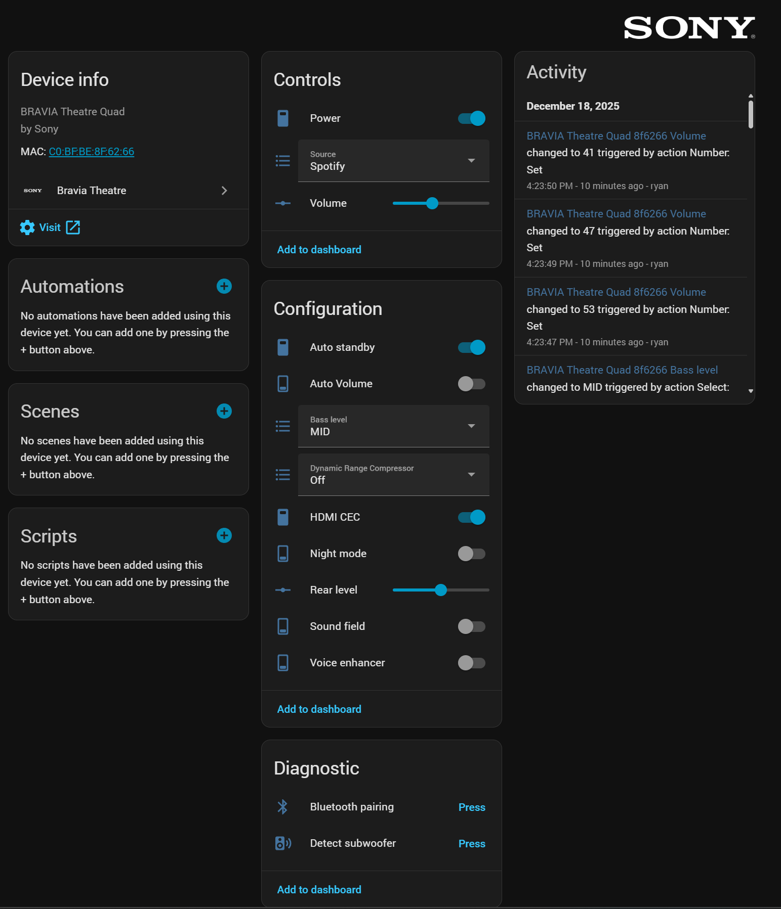

# Bravia Quad Home Assistant Integration

[](https://github.com/custom-components/hacs)
[](LICENSE)

A Home Assistant custom integration for controlling Sony Bravia Quad home theater systems via TCP/IP.

_This integration may also be compatible with other Bravia audio devices - see the [Device Compatibility](#device-compatibility) section for details._

<details>
<summary>View Device Page Screenshot</summary>



</details>

## Features

- **Auto-Discovery**: Automatically discovers Bravia Quad devices on your network using mDNS/zeroconf - no manual IP configuration needed
- **Power Control**: Turn your Bravia Quad system on and off
- **Volume Control**: Adjust main volume from 0-100 via a number entity
- **Rear Level Control**: Adjust rear speaker level from -10-10 via a number entity
- **Source Selection**: Switch between inputs (TV/eARC, HDMI In, Spotify, Bluetooth, Airplay)
- **Bass Level Control**: Automatically adapts based on subwoofer presence:
  - With subwoofer: Slider from -10 to +10
  - Without subwoofer: Select between MIN, MID, MAX
- **Subwoofer Auto-Detection**: Automatically detects if a subwoofer is connected and adjusts bass level controls accordingly
- **Voice Enhancer**: Toggle voice enhancer on/off
- **Sound Field**: Toggle sound field processing on/off
- **Night Mode**: Toggle night mode on/off
- **HDMI CEC**: Toggle HDMI CEC on/off
- **Auto Standby**: Toggle automatic standby behavior on/off
- **Dynamic Range Compressor (DRC)**: Control Dynamic Range Compressor mode (Auto, On, Off) - polls for state changes
- **Auto Volume**: Toggle Auto Volume on/off - polls for state changes
- **Real-time Updates**: Automatically receives and processes notifications from the device for all state changes (where supported)
- **Device Integration**: All entities are properly nested under a single device in Home Assistant

## Device Compatibility

The following table details device compatibility with this Home Assistant integration. Compatibility is based on whether devices use the same TCP/IP protocol (port 33336) as the BRAVIA Theatre Quad.

| Device Name | Model | Compatibility |
|-------------|-------|---------------|
| BRAVIA Theatre Quad | HT-A9M2 | Compatible |
| BRAVIA Theatre Bar 6 | HT-B600/BD60 | Untested |
| BRAVIA Theatre Bar 8 | HT-A8000 | Untested |
| BRAVIA Theatre Bar 9 | HT-A9000 | Untested |
| BRAVIA Theatre System 6 | HT-S60 | Untested |
| HT-AX7 | HT-AX7 | Untested |
| HT-S2000 | HT-S2000 | Untested |

*Note: Devices marked as "Untested" may be compatible if they use the same TCP/IP control protocol. **Compatibility testing and feedback from users with these devices is welcome!**. For a complete list of Sony Sound Bars & Home Theatre Systems, see the [Sony Support Article](https://www.sony.com/electronics/support/articles/00305900).*

## Installation

### HACS (Recommended)

1. Ensure [HACS](https://hacs.xyz/) is installed
2. Go to HACS → Integrations
3. Search for "Bravia Quad" and install it
4. Restart Home Assistant

### Manual Installation

1. Copy the `bravia_quad` folder to your Home Assistant `custom_components` directory:
   ```
   <config>/custom_components/bravia_quad/
   ```

2. Restart Home Assistant

3. Go to **Settings** → **Devices & Services** → **Add Integration**

4. Search for "Bravia Quad" and follow the setup wizard

## Configuration

### Auto-Discovery

The integration supports automatic discovery of Bravia Quad devices on your local network using mDNS/zeroconf. When you add the integration, Home Assistant will automatically detect any Bravia Quad devices and prompt you to configure them.

**If your device is not automatically discovered**, you can add it manually by:

1. Selecting "Bravia Quad" from the integration list
2. Choosing "Configure" or "Submit" when prompted
3. Entering the device's IP address manually
4. Optionally providing a friendly name (defaults to "Bravia Quad")

### Manual Configuration

During setup, you will be prompted to provide:

- **IP Address**: The IP address of your Bravia Quad device (required if not auto-discovered)
- **Name** (optional): A friendly name for the device (defaults to "Bravia Quad")

The integration will automatically test the connection by sending a power status request. Make sure:

- IP control is enabled on your Bravia Quad device
- The device is accessible on your network
- Port 33336 is not blocked by a firewall

## Entities

The integration creates the following entities under your Bravia Quad device:

| Entity | Type | Description | Range/Options |
|--------|------|-------------|---------------|
| `switch.bravia_quad_*_power` | Switch | Control power on/off | on/off |
| `number.bravia_quad_*_volume` | Number | Control main volume | 0-100 |
| `number.bravia_quad_*_rear_level` | Number | Control rear speaker level | -10-10 |
| `number.bravia_quad_*_bass_level` | Number | Control bass level (with subwoofer) | -10-10 |
| `select.bravia_quad_*_bass_level` | Select | Control bass level (without subwoofer) | MIN, MID, MAX |
| `select.bravia_quad_*_source` | Select | Select input source | TV (eARC), HDMI In, Spotify, Bluetooth, Airplay |
| `switch.bravia_quad_*_voice_enhancer` | Switch | Toggle voice enhancer | on/off |
| `switch.bravia_quad_*_sound_field` | Switch | Toggle sound field processing | on/off |
| `switch.bravia_quad_*_night_mode` | Switch | Toggle night mode | on/off |
| `switch.bravia_quad_*_hdmi_cec` | Switch | Toggle HDMI CEC | on/off |
| `switch.bravia_quad_*_auto_standby` | Switch | Toggle auto standby | on/off |
| `select.bravia_quad_*_drc` | Select | Dynamic Range Compressor (DRC) | Auto, On, Off |
| `switch.bravia_quad_*_advanced_auto_volume` | Switch | Auto Volume | on/off |
| `button.bravia_quad_*_detect_subwoofer` | Button | Re-detect subwoofer (diagnostic) | - |
| `button.bravia_quad_*_bluetooth_pairing` | Button | Trigger Bluetooth pairing mode (diagnostic) | - |

*Note: `*` represents your device's unique entry ID*

*Note: Only one bass level entity will be created based on whether a subwoofer is detected.*

## Protocol Details

The integration communicates with the Bravia Quad device via TCP on port **33336** using JSON messages:

### Command Format

**Get Request:**
```json
{"id": 3, "type": "get", "feature": "main.power"}
```

**Get Response:**
```json
{"feature": "main.power", "id": 3, "type": "result", "value": "off"}
```

**Set Request:**
```json
{"id": 3, "type": "set", "feature": "main.power", "value": "on"}
```

**Set Response:**
```json
{"id": 3, "type": "result", "value": "ACK"}
```

### Notifications

When maintaining an open connection, the device sends real-time notifications for all state changes:

```json
{"feature": "main.power", "type": "notify", "value": "on"}
{"feature": "main.volumestep", "type": "notify", "value": "21"}
{"feature": "main.input", "type": "notify", "value": "spotify"}
{"feature": "main.rearvolumestep", "type": "notify", "value": "5"}
{"feature": "main.bassstep", "type": "notify", "value": "1"}
{"feature": "audio.voiceenhancer", "type": "notify", "value": "upon"}
{"feature": "audio.soundfield", "type": "notify", "value": "on"}
{"feature": "audio.nightmode", "type": "notify", "value": "off"}
{"feature": "hdmi.cec", "type": "notify", "value": "on"}
{"feature": "system.autostandby", "type": "notify", "value": "off"}
```

## Supported Commands

### Power Control

- **Get Power State**: `{"id": 3, "type": "get", "feature": "main.power"}`
- **Set Power On**: `{"id": 3, "type": "set", "feature": "main.power", "value": "on"}`
- **Set Power Off**: `{"id": 3, "type": "set", "feature": "main.power", "value": "off"}`

### Volume Control

- **Get Volume**: `{"id": 2, "type": "get", "feature": "main.volumestep"}`
- **Set Volume**: `{"id": 2, "type": "set", "feature": "main.volumestep", "value": 50}` (0-100)

### Rear Level Control

- **Get Rear Level**: `{"id": 2, "type": "get", "feature": "main.rearvolumestep"}`
- **Set Rear Level**: `{"id": 2, "type": "set", "feature": "main.rearvolumestep", "value": 5}` (-10 to 10)

### Source Selection

- **Get Source**: `{"id": 2, "type": "get", "feature": "main.input"}`
- **Set Source**: `{"id": 2, "type": "set", "feature": "main.input", "value": "tv"}`

**Available Sources:**
- `tv` - TV (eARC)
- `hdmi1` - HDMI In
- `spotify` - Spotify
- `bluetooth` - Bluetooth
- `airplay2` - Airplay (Note: Can be detected when active, but cannot be set via command - only activated when an Airplay device casts to the Bravia)

### Bass Level Control

The bass level range depends on whether a subwoofer is connected:

**With Subwoofer:**
- **Get Bass Level**: `{"id": 2, "type": "get", "feature": "main.bassstep"}`
- **Set Bass Level**: `{"id": 2, "type": "set", "feature": "main.bassstep", "value": 5}` (-10 to 10)

**Without Subwoofer:**
- **Get Bass Level**: `{"id": 2, "type": "get", "feature": "main.bassstep"}`
- **Set Bass Level**: `{"id": 2, "type": "set", "feature": "main.bassstep", "value": 1}` (0=MIN, 1=MID, 2=MAX)

### Voice Enhancer

- **Get Voice Enhancer**: `{"id": 1, "type": "get", "feature": "audio.voiceenhancer"}`
- **Set Voice Enhancer On**: `{"id": 1, "type": "set", "feature": "audio.voiceenhancer", "value": "upon"}`
- **Set Voice Enhancer Off**: `{"id": 1, "type": "set", "feature": "audio.voiceenhancer", "value": "upoff"}`

### Sound Field

- **Get Sound Field**: `{"id": 1, "type": "get", "feature": "audio.soundfield"}`
- **Set Sound Field On**: `{"id": 1, "type": "set", "feature": "audio.soundfield", "value": "on"}`
- **Set Sound Field Off**: `{"id": 1, "type": "set", "feature": "audio.soundfield", "value": "off"}`

### Night Mode

- **Get Night Mode**: `{"id": 1, "type": "get", "feature": "audio.nightmode"}`
- **Set Night Mode On**: `{"id": 1, "type": "set", "feature": "audio.nightmode", "value": "on"}`
- **Set Night Mode Off**: `{"id": 1, "type": "set", "feature": "audio.nightmode", "value": "off"}`

### HDMI CEC

- **Get HDMI CEC**: `{"id": 1, "type": "get", "feature": "hdmi.cec"}`
- **Set HDMI CEC On**: `{"id": 1, "type": "set", "feature": "hdmi.cec", "value": "on"}`
- **Set HDMI CEC Off**: `{"id": 1, "type": "set", "feature": "hdmi.cec", "value": "off"}`

### Auto Standby

- **Get Auto Standby**: `{"id": 1, "type": "get", "feature": "system.autostandby"}`
- **Set Auto Standby On**: `{"id": 1, "type": "set", "feature": "system.autostandby", "value": "on"}`
- **Set Auto Standby Off**: `{"id": 1, "type": "set", "feature": "system.autostandby", "value": "off"}`

### Dynamic Range Compressor (DRC)

- **Get DRC**: `{"id": 1, "type": "get", "feature": "audio.drangecomp"}`
- **Set DRC Auto**: `{"id": 1, "type": "set", "feature": "audio.drangecomp", "value": "auto"}`
- **Set DRC On**: `{"id": 1, "type": "set", "feature": "audio.drangecomp", "value": "on"}`
- **Set DRC Off**: `{"id": 1, "type": "set", "feature": "audio.drangecomp", "value": "off"}`

**Note**: The DRC entity uses polling to update its state, as the device does not send notifications for this feature.

### Auto Volume (AAV)

- **Get AAV**: `{"id": 1, "type": "get", "feature": "audio.aav"}`
- **Set AAV On**: `{"id": 1, "type": "set", "feature": "audio.aav", "value": "on"}`
- **Set AAV Off**: `{"id": 1, "type": "set", "feature": "audio.aav", "value": "off"}`

**Note**: The Auto Volume entity uses polling to update its state, as the device does not send notifications for this feature.

_Per [Sony docs](https://helpguide.sony.net/ht/a7000/v1/en/contents/TP1000070959.html) on the feature, Auto Volume should be **disabled** when listening to music._

## Troubleshooting

### Connection Issues

If you encounter connection problems:

1. **Verify IP Address**: Ensure the IP address is correct and the device is on the same network
2. **Check IP Control**: Verify that IP control is enabled on your Bravia Quad device
3. **Firewall**: Ensure port 33336 is not blocked by your firewall
4. **Test Connection**: Test the connection manually using netcat:
   ```bash
   netcat <IP_ADDRESS> 33336
   {"id":3, "type":"get","feature":"main.power"}
   ```
   You should receive a JSON response with the power state.

### Entity States Not Updating

- Check the Home Assistant logs for any error messages
- Ensure the notification listener is running (check logs for "Starting notification listener")
- Try reloading the integration: **Settings** → **Devices & Services** → **Bravia Quad** → **Reload**

### Volume or Source Shows Default Values

- The integration polls for initial values on startup
- If values don't update, check that the device is responding to get commands
- Notifications will update values in real-time when changes occur

## Development

### Using the DevContainer

The easiest way to develop and test this integration is using the included DevContainer configuration with Visual Studio Code.

1. Make sure you have [Visual Studio Code](https://code.visualstudio.com/) and the [Dev Containers extension](https://marketplace.visualstudio.com/items?itemName=ms-vscode-remote.remote-containers) installed.
2. Clone this repository.
3. Open the repository in VS Code and click "Reopen in Container" when prompted (or use the command palette: `Dev Containers: Reopen in Container`).
4. Once the container is ready, run `scripts/develop` to start Home Assistant with the integration loaded.
5. Access Home Assistant at [http://localhost:8123](http://localhost:8123).

### DevContainer Network Modes

The devcontainer supports two network modes that can be switched using VS Code tasks:

#### Bridge Mode (Default)
- **Isolated network**: Container runs on Docker's default bridge network
- **Port forwarding**: Ports are forwarded from container to host
- **Use case**: General development, when mDNS/zeroconf discovery is not needed

#### Host Mode
- **Shared network**: Container shares the host's network stack directly
- **Direct access**: Container can access host network interfaces and services
- **Use case**: **Required for mDNS/zeroconf discovery** - allows the container to receive multicast DNS traffic from devices on your local network

**Why Host Mode for mDNS/Zeroconf?**

mDNS (multicast DNS) and zeroconf discovery rely on Layer 2 network traffic (multicast packets). When using bridge networking (the docker default), these multicast packets are isolated from the Docker network and cannot reach the container. Host networking allows the container to directly access the host's network interfaces, enabling it to receive and respond to mDNS broadcasts from devices like the Bravia Quad system.

**Switching Network Modes:**

1. Open the Command Palette (Ctrl+Shift+P / Cmd+Shift+P)
2. Type "Tasks: Run Task"
3. Select either:
   - **"Devcontainer: Set Host Network Mode"** - For mDNS/zeroconf development
   - **"Devcontainer: Set Bridge Network Mode"** - For default isolated networking
4. **Rebuild the devcontainer** for changes to take effect:
   - Command Palette → "Dev Containers: Rebuild Container"

> **⚠️ Important for Docker Desktop Users:**
>
> If you encounter errors when switching to host mode, you may need to enable host networking in Docker Desktop first:
>
> 1. Sign in to your Docker account in Docker Desktop
> 2. Navigate to **Settings**
> 3. Under the **Resources** tab, select **Network**
> 4. Check the **Enable host networking** option
> 5. Select **Apply and restart**
>
> See the [Docker Desktop host networking documentation](https://docs.docker.com/engine/network/drivers/host/#docker-desktop) for more details.
>
> **Note:** Host networking requires Docker Desktop version 4.34 or later and only works with Linux containers. It also doesn't work with Enhanced Container Isolation enabled.

### Available Scripts

| Script | Description |
|--------|-------------|
| `scripts/setup` | Sets up development environment with uv (installs dependencies + pre-commit hooks) |
| `scripts/develop` | Starts Home Assistant with the integration in debug mode |
| `scripts/lint` | Runs Ruff to format and lint the code |

### Setting Up Development Environment

This project uses [uv](https://docs.astral.sh/uv/) for dependency management.

```bash
# Install dependencies and set up pre-commit hooks
./scripts/setup

# Or manually with uv
uv sync --dev

# Run tests
uv run pytest

# Run Home Assistant in debug mode
./scripts/develop
```

### Project Structure

```
custom_components/bravia_quad/
├── __init__.py              # Integration setup
├── __version__.py           # Version information
├── manifest.json            # Integration metadata
├── config_flow.py           # Configuration flow
├── bravia_quad_client.py    # TCP client for device communication
├── switch.py                # Power switch entity
├── number.py                # Volume number entity
├── select.py                # Source select entity
├── const.py                 # Constants
└── strings.json             # UI strings
```

### Code Quality

This project uses [Ruff](https://docs.astral.sh/ruff/) for linting and code formatting. The configuration follows Home Assistant's coding standards:

- **Linting**: Automated linting runs on all pull requests via GitHub Actions
- **Formatting**: Code is automatically formatted using Ruff
- **Python Version**: Targets Python 3.13.2+

Run linting locally:
```bash
./scripts/lint
```

### Testing

The project includes a comprehensive test suite using pytest:

```bash
# Run all tests
uv run pytest

# Run tests with verbose output
uv run pytest -v

# Run tests with coverage
uv run pytest --cov=custom_components/bravia_quad
```

### CI/CD

This project uses GitHub Actions for continuous integration and deployment:

- **Hassfest**: Validates the integration manifest and ensures compliance with Home Assistant standards
- **Lint**: Runs Ruff to check code quality and formatting on all pull requests
- **Tests**: Runs the pytest test suite on all pull requests
- **Release**: Automated release workflow that:
  - Validates version format
  - Updates version in `pyproject.toml` and `manifest.json`
  - Creates Git tags
  - Generates GitHub releases

Dependencies are automatically kept up to date via [Renovate](https://docs.renovatebot.com/) for:
- GitHub Actions
- Python packages (via pyproject.toml)

### Testing

To test the connection manually:

```bash
# Using netcat
netcat <IP_ADDRESS> 33336
{"id":3, "type":"get","feature":"main.power"}
```

Or using Python:

```python
import socket
import json

s = socket.socket(socket.AF_INET, socket.SOCK_STREAM)
s.connect(('YOUR_IP', 33336))
s.send(b'{"id":3, "type":"get","feature":"main.power"}\n')
response = s.recv(1024).decode()
print(json.loads(response))
s.close()
```

## Contributing

Contributions are welcome! Please feel free to submit a Pull Request.

### Development Guidelines

1. **Code Style**: Follow the existing code style and use Ruff for formatting
2. **Testing**: Test your changes thoroughly before submitting
3. **Pull Requests**:
   - Ensure all CI checks pass (Hassfest, Lint)
   - Update documentation if needed
   - Follow conventional commit messages when possible
4. **Issues**: If you find a bug or have a feature request, please open an issue first to discuss

## License

This integration is provided as-is under the MIT License.

## Disclaimer

This integration is not officially supported by Sony. Use at your own risk.

## Support

For issues, questions, or feature requests, please open an issue on GitHub.

---

**Made with ❤️ for the Home Assistant community**
