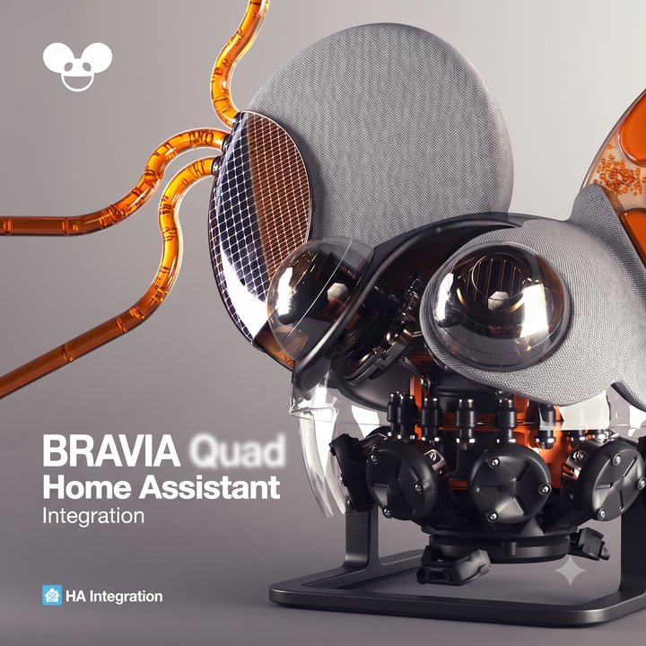
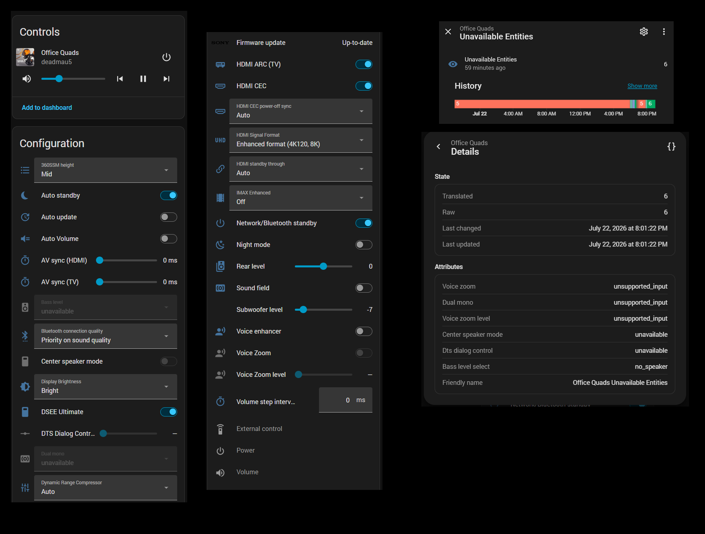
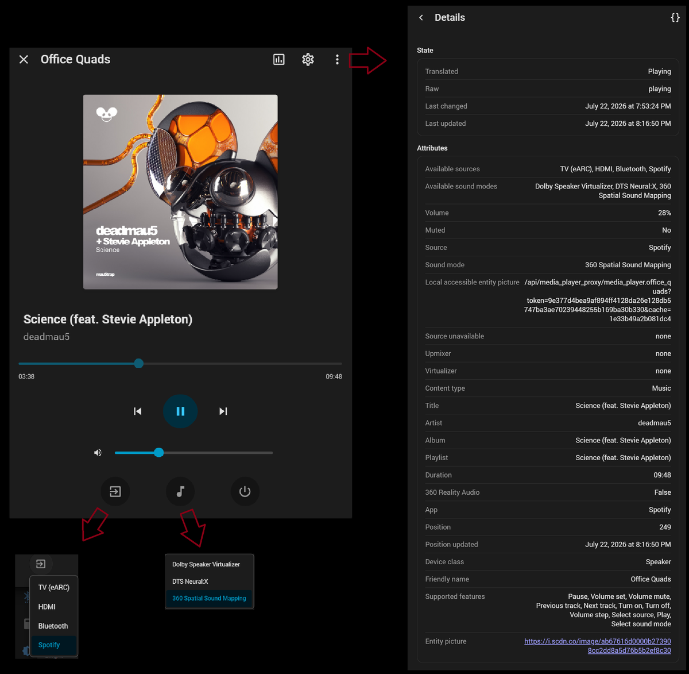

# Bravia Theatre Home Assistant Integration

<table>
  <tr>
    <td>
     A Home Assistant custom integration for Sony Bravia Theatre home theater systems.  
      Choose <strong>gRPC</strong> (recommended, BRAVIA Connect control plane)   or   <strong>TCP</strong> (legacy IP control, no Sony sign-in) at setup.
    </td>
    <td>
    
    </td>
  </tr>
</table>

## Features

- **Auto-discovery** via mDNS/zeroconf — no manual IP required
- **Power, volume, mute, and source** control via media player and companion entities
- **Rear and bass level** — bass adapts automatically (slider with subwoofer, MIN/MID/MAX without)
- **Audio settings** — voice enhancer, sound field, night mode, DRC, auto volume, HDMI CEC, auto standby
- **Real-time updates** from the device where the transport supports notify/push
- **gRPC extras** — now-playing metadata, sound field mode select, play/pause/next on Spotify/Bluetooth/AirPlay, DSEE Ultimate, 360SSM height, and more (see [docs/entities.md](docs/entities.md))
- **Multiple Theatres** — zeroconf rediscovery matches by host or MAC so each device gets its own config entry; entities nest under one HA device per Theatre

> Full entity list: [docs/entities.md](docs/entities.md)

<table>
  <tr>
    <th>Preview</th>
    <th>Description</th>
  </tr>
  <tr>
    <td>
      
    </td>
    <td>
      Device page with configuration entities — sound, HDMI, and system settings all in one place.
    </td>
  </tr>
  <tr>
    <td>
      
    </td>
    <td>
      Media player view — now playing, volume, source control, sound field control and playback controls for streaming sources.
    </td>
  </tr>
</table>

> **Legal and ethical note**
>
> This work was done for **interoperability** — making hardware I own talk to software I run — which is the purpose most explicitly protected for reverse engineering (e.g. the interoperability exemptions under 17 U.S.C. § 1201(f) in the US and Article 6 of the EU Software Directive). It was all done on **my own HT-A9M2, on my own LAN, with my own Sony account and my own credentials.** Nothing here touched anyone else's device, account, or network.
>
> What this project contains and doesn't:
>
> - **No Sony source code, binaries, or assets** were copied, decompiled for redistribution, or shipped. The integration is a clean-room reimplementation of the *wire protocol* — the observable bytes on the network — not of Sony's software.
> - **No secrets are published.** The `client_id` and `x-api-key` values that appear here are non-secret identifiers already sent by the app on every request; they are not account credentials. Session keys, HMAC keys, OAuth tokens, and device IDs are per-user and per-device, are never committed, and are gitignored (see [reverse-engineering-bravia-connect.md](docs/reverse-engineering-bravia-connect.md) for redaction notes).
> - **No Sony service was attacked or overloaded.** Traffic capture was passive observation of my own sessions; the only requests made to Sony's cloud were the same OAuth/session-key calls the official app makes, at human scale.
> - **Credentials belong to the user.** The integration authenticates as *you*, with keys *you* obtain by signing into *your* Sony account — it stores no shared or embedded credential.
>
> Practical caveats: this is an **unofficial** integration with **no affiliation with or endorsement by Sony**. It targets one model on one firmware (`001.454`); Sony can change or break the protocol at any time, and firmware updates may disable it. Trademarks (Sony, BRAVIA) belong to their owners and are used here only to identify the device. **Use at your own risk** — there is no warranty, and you are responsible for complying with the terms of service and laws that apply in your own jurisdiction. Nothing in this document is legal advice.

## Device compatibility

Compatibility depends on whether a device exposes the same control planes as the BRAVIA Quad: legacy TCP (port **33336**) and/or BRAVIA Connect gRPC (port **55051**). Setup chooses one transport — not both.

Capability-gated entities vary by model — see [docs/entities.md](docs/entities.md).

### Models

| Device                  | Model        | Network        | Status                      |
| ----------------------- | ------------ | -------------- | --------------------------- |
| BRAVIA Theatre Quad     | HT-A9M2      | WiFi/Ethernet  | gRPC ✓ · TCP ✓ (fw 001.454) |
| BRAVIA Theatre A9       | HT-A9        | WiFi/Ethernet  | gRPC ✗ · TCP ✓              |
| BRAVIA Theatre Trio     | HT-A8        | WiFi/Ethernet  | gRPC ✓ · TCP ✗              |
| BRAVIA Theatre Bar 8    | HT-A8000     | WiFi/Ethernet  | gRPC * · TCP ✓              |
| BRAVIA Theatre Bar 9    | HT-A9000     | WiFi/Ethernet  | gRPC — · TCP ✓              |
| BRAVIA Theatre Bar 6    | HT-B600/BD60 | Bluetooth only | Incompatible                |
| BRAVIA Theatre System 6 | HT-S60       | Bluetooth only | Incompatible                |
| HT-AX7                  | HT-AX7       | Bluetooth only | Incompatible                |
| HT-S2000                | HT-S2000     | Bluetooth only | Incompatible                |

✓ = verified working · ✗ = not working · — = untested · \* = partial

> Bar 8 gRPC setup reported; feature parity not fully mapped ([#176](https://github.com/steamEngineer/bravia-quad-homeassistant/issues/176))
>
> Theatre Bar 9 TCP: [community report](https://community.home-assistant.io/t/custom-integration-sony-bravia-theatre-quad-bar-8-bar-9-control-testers-needed/972831/2).
>
> Quad (HT-A9M2) gRPC/TCP feature mapping and parity gaps: [docs/grpc-tcp-mapping.md](docs/grpc-tcp-mapping.md). Entity list: [docs/entities.md](docs/entities.md).

**Feedback from owners of untested models is welcome**. For Sony's full product list, see the [Sony support article](https://www.sony.com/electronics/support/articles/00305900).

## Prerequisites

Requirements depend on the transport you choose during setup:

- **Either mode** — Bravia Theatre on your LAN; Home Assistant can reach the device IP.
- **TCP** — enable **External control** in the BRAVIA Connect app (**Settings** → **Network settings**); port **33336** reachable from Home Assistant.
- **gRPC** — port **55051** reachable; complete Sony sign-in during setup. You do **not** need to enable External control beforehand — the integration checks that setting and attempts to enable it automatically when a TCP listener is present (hybrid seed on models that expose port 33336). Step-by-step: [docs/grpc-setup.md](docs/grpc-setup.md).

## Installation

### HACS (Recommended)

Manual HACS steps

1. Ensure [HACS](https://hacs.xyz/) is installed
2. Go to HACS → Integrations
3. Search for "Bravia Theatre" and install it

1. Click **Download**, then restart Home Assistant.

### Add the integration

Manual steps

1. Go to **Settings** → **Devices & Services** → **Add Integration**
2. Search for "Bravia Theatre" and follow the setup wizard

### Manual Installation

1. Copy the `bravia_quad` folder to `<config>/custom_components/bravia_quad/`
2. Restart Home Assistant
3. Add the integration with the button above (or **Settings** → **Devices & Services** → **Add Integration** → "Bravia Theatre")

## Configuration

The integration discovers Bravia Theatre devices automatically. If yours is not found, add it manually with the device IP address.

During setup you choose a **transport**:

| Mode                        | Connection        | Summary                                                                              |
| --------------------------- | ----------------- | ------------------------------------------------------------------------------------ |
| **gRPC** (recommended)      | Port 55051 + HTTP | BRAVIA Connect plane; Sony sign-in; streaming controls and extended sound settings   |
| **TCP** (legacy)            | Port 33336 + HTTP | No sign-in; full diagnostic extras (Bluetooth pairing, temperature, network sensors) |

> **Beta Feature:** gRPC is the recommended transport and still evolving — expect parity gaps vs TCP and occasional changes across releases or firmware.

gRPC mode prompts for Sony sign-in (OAuth). Session keys refresh automatically when possible.

On gRPC, some settings are writable locally but not readable over the local plane. Enable opt-in **Seeds cloud reads** (`grpc_seeds_poll`) in integration options if entities such as DRC stay `unknown` — see [docs/seeds-cloud-states.md](docs/seeds-cloud-states.md).

Step-by-step gRPC setup (Chrome Network redirect, Seeds options): [docs/grpc-setup.md](docs/grpc-setup.md). Transport comparison and migration: [docs/configuration.md](docs/configuration.md#transport-modes).

## Blueprints

Automate settings (**Voice Enhancer**, **Auto Volume**, **Sound Field**, **Night Mode**, **Volume**, **Rear Level**) per input source.

> **TCP mode only** for now — not validated against gRPC entity layouts. Last updated in GitHub release [v1.6.0](https://github.com/steamEngineer/bravia-quad-homeassistant/releases/tag/v1.6.0).

**Manual import:** Settings → Automations & Scenes → Blueprints → Import Blueprint → paste:

`https://github.com/steamEngineer/bravia-quad-homeassistant/blob/main/blueprints/source_based_config.yaml`

## Documentation

| Topic                     | Document                                                                                 |
| ------------------------- | ---------------------------------------------------------------------------------------- |
| **All docs**              | [docs/README.md](docs/README.md)                                                         |
| Setup & transport         | [docs/configuration.md](docs/configuration.md)                                           |
| gRPC setup guide          | [docs/grpc-setup.md](docs/grpc-setup.md)                                                 |
| Entities                  | [docs/entities.md](docs/entities.md)                                                     |
| Troubleshooting           | [docs/troubleshooting.md](docs/troubleshooting.md)                                       |
| TCP protocol              | [docs/tcp-protocol.md](docs/tcp-protocol.md)                                             |
| gRPC reference            | [docs/sony-grpc-reference.md](docs/sony-grpc-reference.md)                               |
| gRPC entity mapping       | [docs/grpc-tcp-mapping.md](docs/grpc-tcp-mapping.md)                                     |
| Reverse-engineering story | [docs/reverse-engineering-bravia-connect.md](docs/reverse-engineering-bravia-connect.md) |
| Development               | [docs/development.md](docs/development.md)                                               |

## Contributing

Contributions welcome! Open a pull request against `main` and complete [`.github/PULL_REQUEST_TEMPLATE.md`](.github/PULL_REQUEST_TEMPLATE.md). See [docs/development.md](docs/development.md) for setup and testing.

## License

This integration is provided as-is under the MIT License.

## Support

For issues, questions, or feature requests, please open an issue on GitHub.

---

**Made with ❤️ for the Home Assistant community**
