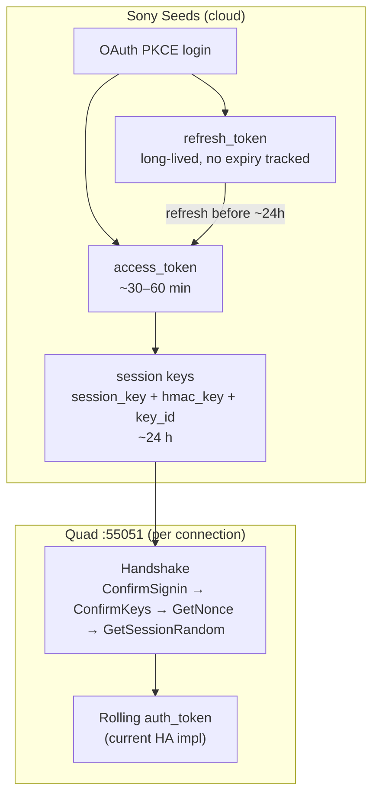

# gRPC authentication and token lifecycles

Documentation index: [docs/README.md](README.md)

> **Contributions:** Corrections in auth semantics and notify-only Seeds reads reported by [@mafredri](https://github.com/mafredri) ([#16](https://github.com/steamEngineer/bravia-quad-homeassistant/issues/16), cross-check in [#136](https://github.com/steamEngineer/bravia-quad-homeassistant/issues/136)).

> **Reference only — observed behavior and current implementation**
>
> This document describes how Sony Seeds OAuth, cloud session keys, and device gRPC auth **appear to work** based on reverse engineering and how the integration **implements them today**. Details may be incomplete, mistaken, or superseded as we learn more about Sony’s APIs and BRAVIA Connect behavior.
>
> **Keep this document updated** whenever auth, refresh, or handshake logic changes in the integration. When implementation and this doc diverge, fix the code or revise this doc in the same change.

Applies to **gRPC transport only**. TCP transport (port 33336) has no token auth.

Primary implementation files:

- [`grpc/credentials.py`](../custom_components/bravia_quad/grpc/credentials.py) — Sony Seeds OAuth and session-key refresh
- [`grpc_refresh.py`](../custom_components/bravia_quad/grpc_refresh.py) — proactive/reactive refresh and HA config-entry persistence
- [`grpc/client.py`](../custom_components/bravia_quad/grpc/client.py) — device handshake and rolling `auth_token`
- [`grpc/get_states_auth.py`](../custom_components/bravia_quad/grpc/get_states_auth.py) — HMAC signing for GetStates/ExecCommand

See also [reverse-engineering-bravia-connect.md](reverse-engineering-bravia-connect.md) for how this was discovered.

---

## Overview

There are **three separate auth layers** in the gRPC path, each with different lifetimes:



---

## 1. Sony Seeds OAuth tokens (cloud)

**Purpose:** Authenticate to Sony’s cloud APIs so the integration can fetch device session keys.

| Token | Typical lifetime | Stored? | Used when? |
|-------|------------------|---------|------------|
| **Authorization code** | Single use, seconds | No | Config flow only |
| **access_token** | Server `expires_in` (tests use 1800–3600 s) | Yes, in `CONF_GRPC_KEYS` JSON | IoT API calls (`/devices`, `/session_keys`) |
| **refresh_token** | Long-lived; **no expiry tracked in code** | Yes, persisted across refreshes | Token refresh only |

### Initial lifecycle (config flow)

1. PKCE login → user completes Sony sign-in → redirect `ssh-app://signin?code=…`
2. Exchange `code` + `code_verifier` → `access_token` + `refresh_token`
3. `GET /devices` → pick `device_id`
4. `POST /devices/{device_id}/session_keys` → gRPC keys
5. Bundle written to config entry as `CONF_GRPC_KEYS`

### Refresh lifecycle

`build_credentials_bundle()` merges new OAuth tokens with new session keys and timestamps:

```python
# custom_components/bravia_quad/grpc/credentials.py — build_credentials_bundle()
bundle["access_token"] = token_response["access_token"]
# refresh_token preserved from previous bundle if not returned again
bundle["access_token_expires_at"] = now + int(expires_in)
bundle["session_keys_expires_at"] = now + int(session_keys["expires_in"])
```

**Important:** `access_token_expires_at` is recorded but **never checked proactively**. Refresh always goes through `refresh_token`, not by reusing a still-valid access token.

---

## 2. gRPC session keys (cloud-issued, ~24 h)

**Purpose:** Long-term credentials that unlock the device handshake. These are what actually matter for day-to-day operation.

| Field | Role | Lifetime |
|-------|------|----------|
| `device_id` | `ConfirmSignin` auth_data = SHA256(device_id) | Stable |
| `key_id` | Used as gRPC `session_id` | New UUID each refresh |
| `session_key` | 32-byte hex key (stored, not used in current auth path) | ~24 h |
| `hmac_key` | Signs ConfirmKeys + every GetStates/ExecCommand | ~24 h |
| `session_keys_expires_at` | Computed from API `expires_in` | **~86400 s (24 h)** per docs/tests |

### Proactive refresh rule

```python
# custom_components/bravia_quad/grpc/credentials.py
SESSION_KEYS_REFRESH_BUFFER = 3600  # 1 hour

def keys_need_refresh(credentials, *, buffer_seconds=SESSION_KEYS_REFRESH_BUFFER):
    expires_at = credentials.get("session_keys_expires_at")
    if expires_at is None:
        return False
    return int(time.time()) >= int(expires_at) - buffer_seconds
```

Refresh triggers when keys are within **1 hour of expiry** (or already expired). If `session_keys_expires_at` is missing, no proactive refresh runs.

### When refresh runs

| Trigger | Where | Behavior |
|---------|-------|----------|
| **Proactive** | HA startup / `async_setup_grpc_client` | Refresh if within 1 h buffer |
| **Reactive (connect fail)** | Initial connect after setup | If auth fails and it’s not a transport error, refresh once and retry |
| **Reactive (reconnect)** | `_async_restore_session` | On auth failure during reconnect, call `_refresh_keys_callback` → full OAuth refresh + new keys, then re-handshake |

Refreshed credentials are written back to the config entry via `async_update_entry`.

### Failure → reauth

Missing or invalid `refresh_token`, or Sony API errors → `ConfigEntryAuthFailed` → HA reauth flow (full OAuth again via `async_step_reauth` in config flow).

---

## 3. Device gRPC session tokens (per connection, rolling)

**Purpose:** Short-lived, in-memory auth for each RPC on the open gRPC channel. **Not persisted** and **not time-based**.

### Handshake (every connect/reconnect)

1. `ConfirmSignin` — `SHA256(device_id)`
2. `ConfirmKeys` — `HMAC-SHA256(hmac_key, key_id)`
3. `GetNonce` — 8-byte nonce + 32-byte value (fetched but **not used** afterward in current code)
4. `GetSessionRandom` — yields initial `session_random` (8 B) + `auth_token` (32 B)

### Rolling `auth_token`

- The `GetSessionRandom` token works **once**.
- After that, each `GetStatesWithAuth` / `ExecCommandWithAuth` must carry an HMAC over the request body using `hmac_key`.
- The device returns a **new** `auth_token` (and sometimes updated `session_random`) in responses; the client chains these in `_apply_get_states_response_tokens()`.

**Lifetime:** Bound to the **TCP/gRPC connection**, not a clock. When the notify stream drops and the client reconnects, the whole handshake runs again from step 1, still using the same cloud `hmac_key`/`key_id` until those expire (~24 h).

**Exec commands** use fresh `GetSessionRandom` before each write by default (`AuthMode.FRESH_EXEC_ONLY`), then HMAC-sign the exec body. The legacy app-mirror preflight (full signed GetStates + mutex probes) runs only as a **fallback** on the first `INVALID_ARGUMENT` from exec — not on every command. See `_refresh_session_tokens()`, `_ensure_preflight_exec_auth_token()`, and `exec_command()`.

**Exec entry point:** `exec_command()` calls `_refresh_session_tokens()` on the happy path. On exec `INVALID_ARGUMENT`, it falls back to `_ensure_preflight_exec_auth_token()` once (which may run `GetSessionRandom` → retry preflight). `AuthMode.APP_MIRROR` retains the old unconditional preflight gate for probes and rollback.

**Async layer:** `BraviaGrpcClientAsync.async_exec_command()` runs the blocking exec in a thread; if it still fails, `_async_restore_session()` (disconnect, re-handshake, GetStates seed) runs once and exec is retried.

### Default auth mode (since #138)

Validated on live HT-A9M2 (2026-07-05): [@mafredri](https://github.com/mafredri)'s simpler exec pattern ([#16](https://github.com/steamEngineer/bravia-quad-homeassistant/issues/16)) works when paired with preflight as retry-only fallback:

| Step | Default (`FRESH_EXEC_ONLY`) | Fallback on `INVALID_ARGUMENT` |
|------|----------------------------|--------------------------------|
| Before exec | `GetSessionRandom` → HMAC-sign exec | Full signed GetStates + mutex preflight (`_ensure_preflight_exec_auth_token`) |
| After exec fail | — | Retry exec once with rolled token from preflight |

`AuthMode` values: `fresh_exec_only` (default), `app_mirror` (legacy unconditional preflight).

### Historical app-mirror behavior

The following table contrasts the **previous** default (pre-#138) with [@mafredri](https://github.com/mafredri)'s findings ([#16](https://github.com/steamEngineer/bravia-quad-homeassistant/issues/16)). The integration now uses the simpler exec path by default; see **Default auth mode** above.

| Topic | Previous HA default (pre-#138) | Current default (#138) | @mafredri's finding (#16) |
|-------|-------------------------------|------------------------|---------------------------|
| Per-RPC auth | Chain rolled `auth_token` from responses | Rolling for reads; fresh `GetSessionRandom` before exec | Fresh `GetSessionRandom` + HMAC each RPC works |
| Exec writes | Unconditional `_ensure_preflight_exec_auth_token()` | `_refresh_session_tokens()` before exec; preflight on `INVALID_ARGUMENT` only | Direct `GetSessionRandom` → `ExecCommandWithAuth` works |
| GetNonce | Always in handshake | Unchanged | May be optional for normal HMAC auth |

### Notify-only reads via Seeds cloud

Per [@mafredri](https://github.com/mafredri) ([#16](https://github.com/steamEngineer/bravia-quad-homeassistant/issues/16)): settings not returned by local gRPC GetStates or the notify stream (DRC, DSEE, dimmer, `sound_effect`, `360ssm_height`, etc.) **are readable** via Sony Seeds `GET /devices/{device_id}/states`, using the same OAuth `access_token` already stored in `CONF_GRPC_KEYS`. BRAVIA Connect uses this path for display. HA can enable this via the **Seeds cloud reads** integration option (`grpc_seeds_poll`) — see [seeds-cloud-states.md](seeds-cloud-states.md) ([#139](https://github.com/steamEngineer/bravia-quad-homeassistant/issues/139)).

---

## Stored credentials bundle (what’s in `CONF_GRPC_KEYS`)

Typical fields after OAuth:

```json
{
  "device_id": "...",
  "key_id": "...",
  "session_key": "...",
  "hmac_key": "...",
  "access_token": "...",
  "refresh_token": "...",
  "access_token_expires_at": 1234567890,
  "access_token_expires_in": 3600,
  "session_keys_fetched_at": 1234567890,
  "session_keys_expires_at": 1234654290
}
```

At runtime, `BraviaGrpcClientAsync` only loads `device_id`, `key_id`, `session_key`, and `hmac_key` for the device handshake. OAuth tokens live in the same blob purely for refresh.

---

## End-to-end timeline (happy path)

```
Day 0, T+0     User completes OAuth → keys + refresh_token stored
Day 0, T+0     HA connects → device handshake → rolling auth_token chain begins
Day 0–1        Notify stream runs; rolling tokens update per RPC; reconnects re-handshake
Day 0, T+23h   Proactive refresh (1 h before 24 h expiry) → new keys + updated config entry
               (uses refresh_token; no user action)
Day N          If refresh_token revoked/expired → ConfigEntryAuthFailed → user re-authenticates
```

---

## Idle exec failure (observed ~1 h)

*Validated on live HT-A9M2; #138 keeps preflight as retry-only fallback so Tier 2 recovery semantics are preserved.*

Reported sequence: **playing** (notify deltas active) → **HA power off** (manual standby) → **immediate power-off notify delta**, then **~60 min quiet notify** (stream may stay open, no further deltas) → **power on fails** with signed GetStates preflight `INVALID_ARGUMENT` while `_connected` remains true.

Auto-standby on the device is a confound; powering off via HA is intentional to control for it.

After the last notify delta at power-off, rolling `session_random` / `auth_token` can go stale over ~1 h while the TCP channel still appears connected. Cloud session keys (~24 h) are usually still valid.

### Relationship to exec preflight (#131)

PR #131 added mandatory HMAC-signed GetStates preflight before every `ExecCommand`. That closed stale-token failures on the **exec send** path (retry after `INVALID_ARGUMENT` on the write). The standby ~1 h repro hit a gap: **initial preflight GetStates** failed with `INVALID_ARGUMENT` and the client returned before calling `GetSessionRandom`. Power-on never reached the exec retry path.

Follow-up fix: `_ensure_preflight_exec_auth_token()` — on preflight fail, `GetSessionRandom` → retry preflight; only then fail or proceed to exec.

### Recovery (current implementation)

1. **Happy path (#138):** `GetSessionRandom` → HMAC-sign exec → send
2. **Exec `INVALID_ARGUMENT`:** `_ensure_preflight_exec_auth_token()` (GetSessionRandom on preflight fail) → retry exec
3. **Still failing** → `BraviaGrpcClientAsync._async_restore_session()` (disconnect, re-auth, re-seed) → one exec retry

Exec failures log a session auth snapshot (tokens, `session_keys_expires_at`, `seconds_since_last_notify`) at WARNING.

### Validation (2026-07-05, live HT-A9M2)

Repro: Spotify playing → HA `turn_off` (power-off notify delta) → 61 min quiet notify (no integration reload) → HA `turn_on`.

**Result: PASS.** At 61 min, logs showed the original failure mode then recovery:

```
GetStates error: INVALID_ARGUMENT: invalid argument!
Exec preflight full GetStates failed
gRPC exec auth failure (preflight failed; refreshing session tokens)
ExecCommand power -> True
```

Recovery used path (1) — GetSessionRandom refresh after preflight fail. Session restore was not required. Entity reached `playing` without manual reload.

Contributors: long soak uses HA REST only (no direct `:55051` clients while HA holds the session). See `development.md` for `./scripts/develop` workflow.

---

## What the integration does *not* track

- **Refresh token expiry** — Sony may revoke it; the integration only discovers that on failed refresh.
- **Access token expiry for proactive refresh** — only `session_keys_expires_at` drives scheduled refresh.
- **Rolling auth_token expiry** — implicit; bad/stale tokens cause RPC failures, not timed refresh.
- **GetNonce values** — fetched per handshake but unused after storage.

---

## Maintenance checklist

When changing auth behavior, update this document if any of the following change:

- [ ] OAuth endpoints, client ID, or PKCE flow
- [ ] Fields stored in `CONF_GRPC_KEYS` / `build_credentials_bundle()`
- [ ] `SESSION_KEYS_REFRESH_BUFFER` or proactive refresh conditions
- [ ] Device handshake RPC order or signing rules
- [ ] Reconnect / refresh callback behavior in `grpc_refresh.py` or `bravia_grpc_client.py`
- [ ] Exec auth mode / preflight fallback (`AuthMode`, `_refresh_session_tokens` before exec, `_ensure_preflight_exec_auth_token`)
- [ ] Idle exec failure symptoms or validation notes when repro conditions change
- [ ] Observed Sony API lifetimes (`expires_in` values) that differ from ~24 h / ~30–60 min
