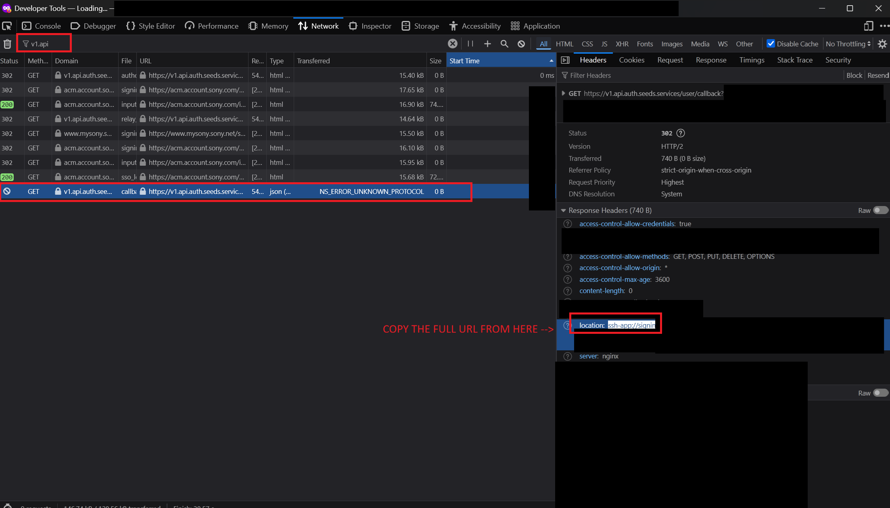

# Configure gRPC transport

Step-by-step guide for setting up **gRPC** (BRAVIA Connect) control in Home Assistant.

gRPC is the **recommended** transport but is still **experimental**. It uses the same local control plane as the Sony Home Entertainment Connect app: live push updates, now-playing metadata, streaming transport controls, and extended sound settings. Expect parity gaps and breaking changes between releases.

For a short transport comparison, see [configuration.md](configuration.md#transport-modes). For entity differences vs TCP, see [grpc-tcp-mapping.md](grpc-tcp-mapping.md#parity-gaps).

## Prerequisites

1. **Home Assistant** with this integration installed (HACS or manual — see [README](../README.md#installation)).
2. **Bravia Theatre on your LAN** with a known IP address (or mDNS discovery).
3. **Port 55051** reachable from Home Assistant (not blocked by a firewall).
4. A **Sony account** that already owns / can control the device in BRAVIA Connect.
5. **Chrome** or **Firefox** for the one-time Sony sign-in step below (the Network redirect copy differs slightly by browser).

You do **not** need to turn on **External control** in the Sony app beforehand. During gRPC setup and reconnect, the integration checks that setting and attempts to enable it automatically when needed.

Verified on BRAVIA Theatre Quad (HT-A9M2). Other models that expose gRPC may work; see [device compatibility](../README.md#device-compatibility).

## Setup wizard

1. Go to **Settings** → **Devices & Services** → **Add Integration**.
2. Search for **Bravia Theatre**.
3. If the device was discovered, confirm it. Otherwise enter the device **IP address**.
4. On **Connection method**, choose **gRPC — BRAVIA Connect (recommended, EXPERIMENTAL)**.
5. Complete **Sony sign-in** (next section).
6. If your Sony account has more than one device, select the Bravia Theatre you are setting up.
7. Confirm the successful connection to finish.

To switch later between gRPC and TCP, remove the integration and add it again. Transport cannot be changed in place because the entity set differs.

## Sony sign-in (OAuth)

gRPC needs a one-time Sony account login. Desktop browsers cannot open the app deep link (`ssh-app://…`), so you copy that URL from the browser’s Network tools and paste it into Home Assistant.

### Before you click the sign-in link

1. Open **Chrome** or **Firefox**.
2. Press **F12** (or **Ctrl+Shift+I** / **Cmd+Option+I**) → **Network**.
3. Enable **Preserve log** (Chrome) / keep the Network panel recording (Firefox).
4. Keep DevTools open for the rest of the login.

### Sign in

1. In the Home Assistant setup step, open the provided Sony sign-in link.
2. Sign in with the Sony account used for Home Entertainment & Sound Service / BRAVIA Connect.
3. After login, the browser tries to open `ssh-app://signin?…` and fails on desktop. **That is expected** — the URL does **not** appear in the address bar.

### Copy the redirect

#### Chrome

1. In **Network**, filter for `signin`.
2. Find the request to `ssh-app://signin?code=…`.
3. Copy the full URL from **Request URL**, or from the **Location** response header.

#### Firefox

1. In **Network**, filter for `v1.api`.
2. Select the `callback` request that shows **`NS_ERROR_UNKNOWN_PROTOCOL`** in the Transferred column (status **302**).
3. Open **Headers** → **Response Headers**.
4. Copy the full value of the **`location`** header (`ssh-app://signin?code=…`).

### Paste into Home Assistant

In Home Assistant, continue to the paste step and paste either:

- the full `ssh-app://signin?code=…` URL, or
- only the `code` value.

Home Assistant exchanges the code for session credentials, connects to the device on port **55051**, and finishes setup. Session keys refresh automatically when a refresh token is available.

### Multiple Sony devices

If the account lists more than one IoT device, the wizard asks you to pick the Bravia Theatre that matches the IP you entered. Choose the correct device; a mismatch aborts with a wrong-account error.

## After setup: recommended options

Open the integration → **Configure** (gRPC entries only):

| Option                                                                  | Default | When to enable                                                                                                                                                                                                                                                                                               |
| ----------------------------------------------------------------------- | ------- | ------------------------------------------------------------------------------------------------------------------------------------------------------------------------------------------------------------------------------------------------------------------------------------------------------------ |
| **Read notify-only settings from Sony Seeds cloud** (`grpc_seeds_poll`) | off     | **Recommended** if entities such as DRC, DSEE Ultimate, 360SSM height, HDMI ARC (TV), or display brightness stay `unknown` or stale. Uses the same Sony cloud API BRAVIA Connect uses for those reads (credit [@mafredri](https://github.com/mafredri)). See [seeds-cloud-states.md](seeds-cloud-states.md). |
| **Verbose gRPC debug logging** (`grpc_debug`)                           | off     | Only when debugging connection or auth issues                                                                                                                                                                                                                                                                |

Seeds cloud reads are opt-in because they send device setting reads through Sony’s cloud (same as the official app). Local gRPC writes still go to your device on the LAN.

## What you get in gRPC mode

Typical gRPC capabilities (exact set depends on model and firmware):

- Media player with live notify, volume, mute, source, and **sound field mode**
- Now-playing metadata and play / pause / next on Spotify, Bluetooth, and AirPlay (where the device supports it)
- Sound settings such as DSEE Ultimate, 360SSM height, center speaker mode, DTS Dialog Control, subwoofer level (with sub)
- Shared settings also available on TCP (night mode, voice enhancer, AV sync, and others)

Some settings are writable over local gRPC but **not readable** on current firmware without Seeds cloud reads (or HA restore / last write). Details: [sony-grpc-reference.md](sony-grpc-reference.md#notify-only-paths) and [seeds-cloud-states.md](seeds-cloud-states.md).

TCP-only extras (Bluetooth pairing button, HDMI passthrough, temperature, some network diagnostics) are not available in gRPC mode — see [grpc-tcp-mapping.md](grpc-tcp-mapping.md#parity-gaps).

## Re-authentication

If Home Assistant prompts to re-authenticate (session expired, account change, or device unreachable):

1. Open the integration re-auth flow (or remove/re-add if needed).
2. Confirm or update the device IP.
3. Repeat the Sony sign-in steps above with a **fresh** login link.

Do not reuse an old `ssh-app://` URL or authorization code.

## Common problems

| Symptom                                        | What to try                                                                                                |
| ---------------------------------------------- | ---------------------------------------------------------------------------------------------------------- |
| Cannot connect during setup                    | Confirm IP and port **55051** from the HA host; reload once so the integration can re-check External control |
| Invalid OAuth redirect / cannot read code      | Keep Network open with preserve/recording on; copy the full `ssh-app://signin?…` URL from Network (Chrome Request URL / Firefox `location` header), not the address bar |
| Sony sign-in failed                            | Start the flow again and use a **new** sign-in link                                                        |
| Wrong account / device                         | Sign in with the account that owns the Quad in BRAVIA Connect; pick the matching device if prompted        |
| Entities stuck on `unknown`                    | Enable **Seeds cloud reads** in options, then reload the integration                                       |
| Missing Bluetooth pairing / temperature / etc. | Those are TCP-only (for now!); use TCP transport or accept the gRPC feature set                            |
| Power / commands fail after long standby       | Reload usually not required; see [troubleshooting.md](troubleshooting.md#grpc-specific-issues)             |

More detail: [troubleshooting.md](troubleshooting.md).

## Related docs

- [configuration.md](configuration.md) — discovery, transport summary, options table
- [entities.md](entities.md) — entity reference
- [seeds-cloud-states.md](seeds-cloud-states.md) — Seeds cloud reads for notify-only settings
- [grpc-tcp-mapping.md](grpc-tcp-mapping.md) — gRPC ↔ TCP mapping and parity gaps
- [sony-grpc-reference.md](sony-grpc-reference.md) — protocol reference
- [grpc-auth-lifecycle.md](grpc-auth-lifecycle.md) — session and token lifecycle
