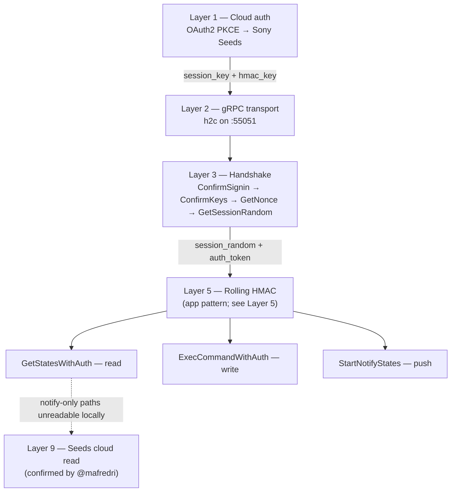
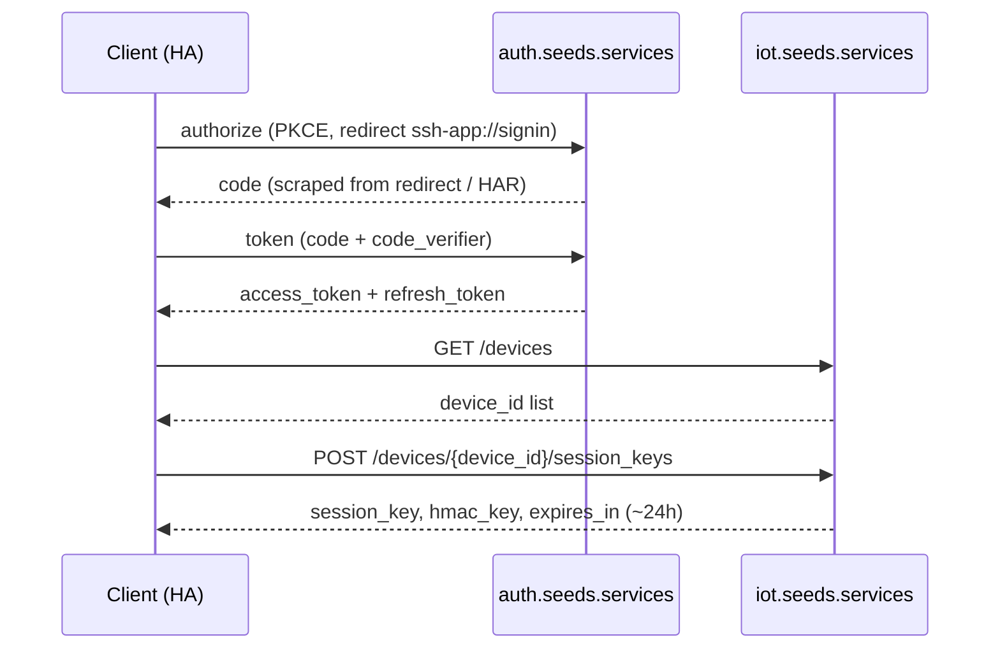
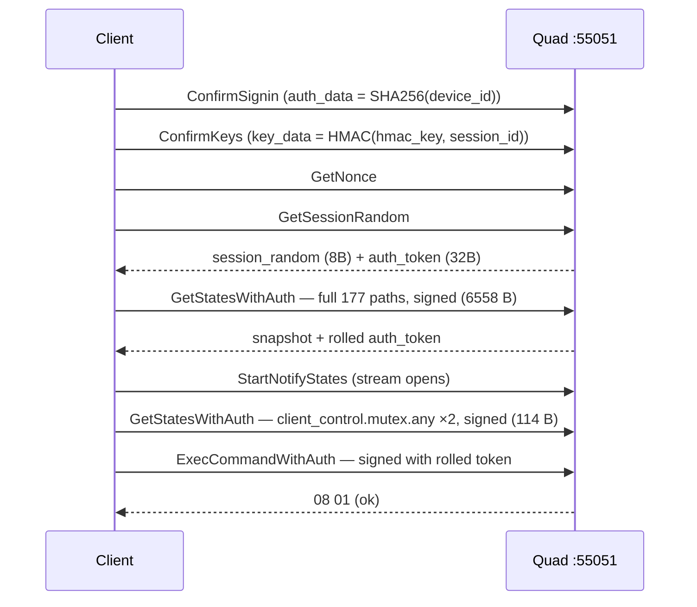
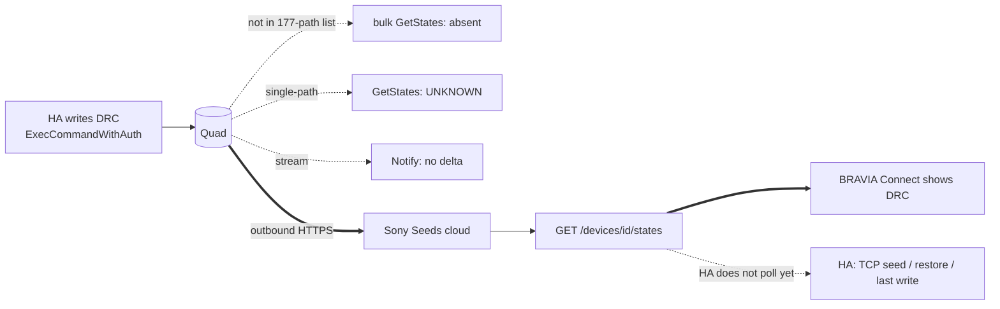
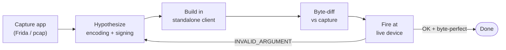

# How I reverse-engineered BRAVIA Connect

Documentation index: [docs/README.md](README.md)

> **Contributions:** Corrections in Layers 4–9 reported by [@mafredri](https://github.com/mafredri) ([#16](https://github.com/steamEngineer/bravia-quad-homeassistant/issues/16), cross-check in [#136](https://github.com/steamEngineer/bravia-quad-homeassistant/issues/136)).

A field report on going from "Sony's phone app can control my Bravia Theatre Quad, so why can't Home Assistant?" to a standalone Python gRPC client that authenticates, reads live state, and writes settings — all without any public API.

Target: **Sony HT-A9M2 (Bravia Theatre Quad)**, firmware `001.454`. App: **BRAVIA Connect** (`jp.co.sony.hes.home` 3.6.3, Android). This is the story; the byte-level reference lives in the sibling docs linked throughout.

And to be upfront about it: this was **AI-driven reverse engineering.** I didn't hand-decode 6558 bytes of protobuf with a hex editor and a coffee. I drove Cursor agents through the whole thing — capture, hypothesis, encoder, byte-diff, live probe — using a set of **skills, plans, and command entry points I built specifically for this device.** The [AI workflow section](#the-ai-workflow-skills-plans-and-entry-points) below lays out exactly what those were, because the tooling *is* the interesting part of how this got solved so fast.

> **Legal and ethical note**
>
> This work was done for **interoperability** — making hardware I own talk to software I run — which is the purpose most explicitly protected for reverse engineering (e.g. the interoperability exemptions under 17 U.S.C. § 1201(f) in the US and Article 6 of the EU Software Directive). It was all done on **my own HT-A9M2, on my own LAN, with my own Sony account and my own credentials.** Nothing here touched anyone else's device, account, or network.
>
> What this project contains and doesn't:
>
> - **No Sony source code, binaries, or assets** were copied, decompiled for redistribution, or shipped. The integration is a clean-room reimplementation of the *wire protocol* — the observable bytes on the network — not of Sony's software.
> - **No secrets are published.** The `client_id` and `x-api-key` values that appear here are non-secret identifiers already sent by the app on every request; they are not account credentials. Session keys, HMAC keys, OAuth tokens, and device IDs are per-user and per-device, are never committed, and are gitignored (see the redaction notes throughout).
> - **No Sony service was attacked or overloaded.** Traffic capture was passive observation of my own sessions; the only requests made to Sony's cloud were the same OAuth/session-key calls the official app makes, at human scale.
> - **Credentials belong to the user.** The integration authenticates as *you*, with keys *you* obtain by signing into *your* Sony account — it stores no shared or embedded credential.
>
> Practical caveats: this is an **unofficial** integration with **no affiliation with or endorsement by Sony**. It targets one model on one firmware (`001.454`); Sony can change or break the protocol at any time, and firmware updates may disable it. Trademarks (Sony, BRAVIA) belong to their owners and are used here only to identify the device. **Use at your own risk** — there is no warranty, and you are responsible for complying with the terms of service and laws that apply in your own jurisdiction. Nothing in this document is legal advice.

---


## Why bother

The Quad already had a legacy TCP control plane (the integration's default `TCP` transport). But BRAVIA Connect exposes things TCP never does: live push notifications, now-playing metadata, transport controls for Spotify/Bluetooth/AirPlay, sound-field modes. The only way to get those into HA was to speak whatever the app speaks. So the question became: **what does the app actually send?**

It broke down into three problems stacked on top of each other — cloud auth, transport, and per-message signing — each one invisible until the one before it was solved. Then a fourth, nastier one showed up: settings the app can *change* but nobody can *read back*.




---


## The toolkit

- **HAR / browser DevTools** — for the OAuth redirect chain (the sign-in happens in a webview).
- **Frida on a rooted Android phone** (LineageOS 15), driven from WSL over an adb bridge — for hooking the app's crypto and gRPC calls in memory. This was the workhorse. *(The Frida/pcap capture scripts are local tooling and are not committed to this repo.)*
- **A managed switch (Ubiquiti EdgeSwitch, "ES8") doing SPAN/RPCAP LAN capture** — for seeing traffic Frida couldn't attribute, and for answering the "does the phone talk to the Quads or something else for this data?" question.
- **A standalone Python client** (`[grpc/client.py](../custom_components/bravia_quad/grpc/client.py)`) — the thing under construction, and also the test harness. Every hypothesis got encoded as a single question: "can the standalone client reproduce the app's bytes and get a non-error response?"

The one principle that mattered most: **byte-perfect diffing against real app captures.** Every request builder in `grpc/` was validated by comparing its output against a Frida-captured frame from BRAVIA Connect, byte for byte. If it didn't match, it was wrong — full stop. No amount of "protobuf should accept this" counted, because the device didn't.

---


## The AI workflow: skills, plans, and entry points

The reason this went from "no public API" to a working client (fairly) quickly isn't that the protocol was easy — it's that I stopped doing the analysis by hand and built **AI entry points** so a Cursor agent could run the capture-hypothesize-diff-probe loop mostly on its own. This section is the honest accounting of that, because it was the actual method.

*(All of the artifacts below live under* `.cursor/` *and are gitignored — they're my local agent setup, not part of the shipped integration. Treat the descriptions here as the record; the files themselves aren't committed.)*

### Skills (reusable agent capabilities I authored)

A Cursor **skill** is a `SKILL.md` an agent loads on demand — a packaged "here's how to do X on this hardware" playbook with the exact commands, gotchas, and safety rules baked in. I wrote three that carried this project:

- `bravia-quad-ha-dev` — the master playbook for anything touching the live Quad: run Home Assistant on the host (not the DevContainer), which ports mean what (`33336` TCP, `54545` HTTP, `55051` gRPC), how to inspect the on-disk registries, and — critically — the **three-layer observation model**. Frida on the phone, ES8 LAN capture, gRPC endpoint probes) with a table mapping each capture/analysis entry point to when to use it. This is what let an agent go "I need to see what the phone sends" and immediately know the command, the permissions, and where the pcap lands.
- `ha-framework-docs` — a guardrail skill: when the agent touched Home Assistant framework internals (ConfigEntry lifecycle, config flow, entity registries), this told it to read the pinned `homeassistant` source in the venv and fall back to specific Context7 doc sets rather than hallucinate an API. Reverse engineering is exactly where a model is most tempted to invent plausible-but-wrong framework calls; this kept it grounded.
- `es8-remote-capture` — a fully self-contained skill that starts/stops Ubiquiti EdgeSwitch RPCAP capture and pulls pcaps back to the working directory.


### Plans (structured, resumable agent objectives)

A Cursor **plan** is a checklist-with-context that an agent executes and checks off across sessions. Two drove the gRPC work, and their shape mirrors the layer structure of this doc:

- `unlock_getstateswithauth` — the plan that cracked Layer 5. Its todos read like the scientific method applied to a protocol: *refresh auth and gate all live work on a successful handshake → establish a baseline failure report with a probe matrix → use Frida/LAN capture to get app ground truth → capture the GetStates HMAC preimage → replicate the mutex/RPC ordering → parse the response → document and wire into HA.* Each was a discrete agent objective with a clear done-condition (`INVALID_ARGUMENT` → `OK`).
- `grpc_ha_integration` — the broader "expose gRPC-only entities in HA" plan, deliberately marked **deferred / superseded** once it became clear the read path had to be unlocked first. Keeping a plan and explicitly parking it (rather than half-doing it) was itself part of the method — it stopped the agent from scope-creeping into entity work while the transport was still failing.

The "gate everything on a successful handshake first" todo is worth calling out: it meant an agent never burned a session chasing a phantom encoding bug when the real problem was a 24h-expired `session_key`.

### Entry points (the scripts an agent invokes)

The skills point at a fleet of small, single-purpose scripts — probe matrices, byte-diff analyzers, Frida capture runners, and the "gold" correlated-capture runner that fires an ES8 tap, a cold-start Frida hook, and a timed write in one shot and merges them into an H1–H5 hypothesis verdict. These are the hands the agent used to actually *do* each turn of the verification loop. *(All local investigation tooling — not committed; see the redaction notes throughout.)*

### Why this mattered

The device gives one error for everything (`INVALID_ARGUMENT`), so progress depended entirely on tight, repeatable capture-and-diff cycles. Encoding that cycle as skills + plans + scripts meant each agent turn started with the right commands, the right permissions, and the right safety rails — instead of re-deriving them — and I could resume the hunt days later without reloading all the context into my own head. The protocol knowledge is in the `grpc/` code; the **method** is in the `.cursor/` setup.

---


## Layer 1: Cloud authentication (OAuth2 PKCE → Sony Seeds)

The app doesn't authenticate to the *device* with a password. It authenticates to **Sony Seeds Services** in the cloud, which hands back per-device session keys. Reconstructing this gave HA an OAuth flow it could run on its own.




The chain, reconstructed in `[grpc/credentials.py](../custom_components/bravia_quad/grpc/credentials.py)`:

1. **Authorize** — OAuth2 with PKCE against `https://v1.api.auth.seeds.services/user/authorize`. The redirect target is a custom scheme, `ssh-app://signin`, which desktop browsers can't follow — so the authorization `code=` has to be scraped from the DevTools Network tab or a HAR (`extract_ssh_app_redirect_from_har`). The client ID (`4f97b8e2-…`) and API key were pulled straight from the app.
2. **Token exchange** — `code` + `code_verifier` → `access_token` + `refresh_token`. The `User-Agent` matters (`Dalvik/2.1.0 … Pixel 3a`); the API is picky about it.
3. **List devices** — `GET https://v1.api.iot.seeds.services/devices` with a *different* IoT user-agent and an `x-api-key`.
4. **Get session keys** — `POST /devices/{device_id}/session_keys` returns the payload that makes everything else possible:
  - `device_id`, `key_id`
  - `session_key` (32 bytes, hex)
  - `hmac_key` (32 bytes, hex) — **the crown jewel**; it signs every subsequent message
  - `expires_in` (~24h)

Reproducing this end-to-end is `[scripts/grpc/get_session_keys.py](../scripts/grpc/get_session_keys.py)`; HA runs the async version during config-flow sign-in and refreshes via `refresh_token` before the 24h expiry.

Full RPC/credential reference: [sony-grpc-reference.md](sony-grpc-reference.md).

---


## Layer 2: Finding the transport

A proto dump from my previous crack at this, plus a bit of `Runtime.evaluate` poking, showed the device listening on `{host}:55051`**, gRPC over h2c** (HTTP/2 *cleartext* — no TLS).

Service:

```
jp.co.sony.hes.ssh.controldevice.v1.ControlDeviceService
```

with the RPCs that matter: `ConfirmSignin`, `ConfirmKeys`, `GetNonce`, `GetSessionRandom`, `GetStatesWithAuth`, `StartNotifyStates`, `ExecCommandWithAuth`.

That h2c-without-TLS detail is why the Python client uses `grpc.insecure_channel` with hand-tuned keepalive options: the device rejects pings that come too often (`too_many_pings`), so the intervals are dialed well above its threshold (`client.py` [→](../custom_components/bravia_quad/grpc/client.py) `connect()`).

---


## Layer 3: The handshake chain

Frida-hooking the app's outbound gRPC calls revealed the exact cold-start order, reproduced in `client.py` [→](../custom_components/bravia_quad/grpc/client.py) `authenticate()`:

1. `ConfirmSignin` — `auth_data = SHA256(device_id)`. Device-specific, *not* session-specific. (I burned time here assuming it was derived from `session_key`; hooking proved it was just the plain SHA256 of the device UUID.)
2. `ConfirmKeys` — `key_data = HMAC-SHA256(hmac_key, session_id)`, where `session_id` is the `key_id` UUID from the session-keys API.
3. `GetNonce` — an extra step in the app's chain I missed at first; the client fetches it before `GetSessionRandom`.
4. `GetSessionRandom` — returns `session_random` (8 bytes) and an initial `auth_token` (32 bytes). These seed the *rolling* auth for everything after.

One useful early discovery: `ConfirmSignin` can return `success=false` and the session still works. The device is lenient about that step — but strict about the HMAC signing later, which is where the real difficulty lived.

---


## Layer 4: Our early proto reconstruction was wrong

Here's the trap that cost the most time. We initially checked in a monolithic `bravia_control.proto` and the obvious move was to build `GetStatesWithAuthRequest(field_list=…, auth_token=…)` and call `SerializeToString()`. **It fails with** `INVALID_ARGUMENT` **every single time.**

The problem was **our** proto — an incorrectly reconstructed schema from an early pass — not Sony's device schema. Per [@mafredri](https://github.com/mafredri)'s cross-check ([#16](https://github.com/steamEngineer/bravia-quad-homeassistant/issues/16)), the authoritative shape from gRPC server reflection uses an outer `GetStatesWithAuthRequest { serialized_request, hmac }` wrapping an inner `GetStatesRequest { repeated names }`. The same pattern applies to `ExecCommandWithAuth`. Reflected protos are kept in the investigation repo only — not committed here. The monolithic `.proto` has since been removed; this repo keeps generated [`bravia_control_pb2*.py`](../custom_components/bravia_quad/grpc/) stubs for handshake/notify only.

`GetStatesWithAuth` and `ExecCommandWithAuth` still require **hand-encoded raw protobuf bytes** in our client because the generated proto3 stubs do not match the reflected layout. That's why `grpc/` has [`get_states_request.py`](../custom_components/bravia_quad/grpc/get_states_request.py) and [`exec_command_request.py`](../custom_components/bravia_quad/grpc/exec_command_request.py) building byte strings directly instead of using generated message classes, and why the client's unary callables pass a raw-bytes `request_serializer`.

The full-snapshot request on the wire is an outer envelope around the inner serialized blob:

```
12 20 <32-byte hmac>                    ← outer GetStatesWithAuthRequest.hmac
0a <varint len> <inner>                 ← outer serialized_request
   inner = 0a <len> (repeat: 0a <len> <path>)   ← GetStatesRequest.names (177 in Connect's bulk snapshot)
         + 12 <len> (0a 08 <session_random> 1a <len> <key_id UUID>)
```

The session embed (`session_random` + `key_id`) tripped me up repeatedly — it's a nested message *inside* the inner blob, not a top-level field on the flat proto3 message we checked in. Get one length prefix wrong and everything after it shifts, and the device just answers `INVALID_ARGUMENT` with zero diagnostics.

---


## Layer 5: The rolling HMAC — the hard part

### What we learned (still valid)

Every `GetStatesWithAuth` and `ExecCommandWithAuth` carries a 32-byte HMAC signature. The `GetSessionRandom` token works *once*; after that the device expects a fresh signature computed from the request contents. So the whole game came down to: **what exactly gets HMAC'd, and with which key?**

First instinct: hook OpenSSL's native `HMAC()` and read the arguments. I wrote a native-`HMAC()` Frida hook for exactly that *(local tooling, not committed)*. **It captured zero HMAC ops for GetStates.** The app's crypto for this path never touches native `libcrypto` — it lives in the Dart runtime, because BRAVIA Connect is a Flutter app.

The fix was a **blutter-based Dart hook** (run via the local Frida harness in its `LOAD_HMAC` mode), hooking the Dart function `hmacApplyMac` at a fixed blutter offset. That finally logged the preimage and its length, and two clean data points cracked it:

- Full GetStates: `data_len=6521`
- Mutex GetStates (`client_control.mutex.any`): `data_len=78`

Correlating those lengths against the request bytes gave the rule, now encoded in [`get_states_auth.py`](../custom_components/bravia_quad/grpc/get_states_auth.py):

> `hmacApplyMac` **signs the *inner* request body only** — the field-list block plus the session embed. **No outer** `0a` **tag/length, no** `12 20` **auth field.** Then `hmac = HMAC-SHA256(hmac_key, that_preimage)`.

`ExecCommand` uses the same rule over its own (smaller, ~68-byte) command body.

Proof it worked: the standalone client's full GetStates request is **byte-identical to the Frida-captured full-snapshot frame** (6558 B), and the live matrix probe reports `hmac_signed_full`, `signed_preflight`, and `app_sequence` all OK. *(Full signing breakdown lives in local investigation notes, not committed.)*

### What @mafredri corrected

Per [@mafredri](https://github.com/mafredri)'s cross-check ([#16](https://github.com/steamEngineer/bravia-quad-homeassistant/issues/16)):

- **Rolling token chain** — chaining `auth_token` values from each response is a **BRAVIA Connect app optimization**, not a protocol requirement. He reports that calling `GetSessionRandom` before every RPC (then signing with `hmac_key`) works reliably on iOS.
- **Exec preflight** — the mutex + full GetStates dance before exec is **what HA implements today** (mirroring Android app captures), not proven required. He reports direct `GetSessionRandom` → `ExecCommandWithAuth` works in his testing. Simplification is tracked in [#138](https://github.com/steamEngineer/bravia-quad-homeassistant/issues/138).

*Cold-start sequence mirrored from Android app captures — HA's current client follows this; simpler patterns may suffice ([#138](https://github.com/steamEngineer/bravia-quad-homeassistant/issues/138)).*



The gotcha that shaped HA's current exec path: a `GetSessionRandom` token alone isn't always accepted for writes after idle notify. The app runs a full-snapshot GetStates *and* a `client_control.mutex.any` probe first, and it's the token that rolls through *those* that signs the exec. That mutex-preflight dance is `_preflight_exec_auth_token()` / `get_states_app_sequence()` in today's client.

---


## Layer 6: The Connect app's 177-path snapshot

`GetStates` sends the device a *list* of the field paths it wants back. My first list (171 paths, reverse-engineered from an older encoder) → `INVALID_ARGUMENT`. Diffing my request against the Frida capture byte-by-byte *(with a local hex-export analyzer, not committed)* revealed **six missing paths**, including `notification.standby_power_status`. Adding them brought the request to **177 paths / 6558 B** — byte-perfect against Connect's bulk GetStates on fw `001.454`. The canonical list is checked in as [`grpc/all_field_paths.txt`](../custom_components/bravia_quad/grpc/all_field_paths.txt). `client_control.mutex.any` is deliberately *not* in that list; it's a separate 114 B probe.

Per [@mafredri](https://github.com/mafredri)'s cross-check ([#16](https://github.com/steamEngineer/bravia-quad-homeassistant/issues/16)), the device accepts **any valid path names individually or in flexible batches** — the 177-path snapshot is what Connect sends, not a hard device requirement. Many of our early `INVALID_ARGUMENT` failures were simultaneous encoding and signing bugs, not path-count mandates.

---


## Layer 7: Decoding the response (three landmines)

The `GetStates` response is yet another bespoke nested layout — top-level field 2 → field 1 → a concatenated stream of path/value entries. Parsing it in `[get_states_response.py](../custom_components/bravia_quad/grpc/get_states_response.py)` hit three bugs worth naming, because each one produced *plausible-but-wrong* values instead of an obvious crash:

1. `08 XX` **is not a bool.** Inside a value field, `08 XX` is a protobuf varint wrapper, not a boolean. `volume=34` arrives as `12 02 08 22`; read that `08` as "true" and you silently corrupt every integer.
2. **Parse sequentially, at** `0a` **boundaries only.** The path field tag is *also* `0x0a`, so scanning for "every `0x0a` byte" misaligns entries. You have to walk length-prefixed entries in order.
3. **Large varints are signed int64.** Rear volume `-3` and duration `-1` arrive as huge unsigned varints (≥ 2⁶³). Decode them as unsigned and you get nonsense; they have to be reinterpreted as signed.

With those fixed, a snapshot decodes cleanly: `volume=34`, `power=true`, `sound_setting.volume.rear=-3`, `friendly_name="Office Quads"`, `fw_update.version.main="001.454"`, and so on.

Per the reflected schema ([@mafredri](https://github.com/mafredri), [#16](https://github.com/steamEngineer/bravia-quad-homeassistant/issues/16)), responses arrive as `GetStatesResponseWithHmac { serialized_response, hmac }` inside the outer `GetStatesWithAuthResponse` wrapper.

---


## Layer 8: Notify stream field naming

`StartNotifyStates` is a server-streaming RPC that pushes state changes. Per [@mafredri](https://github.com/mafredri)'s cross-check ([#16](https://github.com/steamEngineer/bravia-quad-homeassistant/issues/16)) and the reflected schema, the stream delivers `NotifyStatesWithAuth` → `NotifyStatesWithHmac { serialized_states, hmac }` — not the flat `states` field our outdated stub implies, and not a field named `session_random`.

Our generated stub and [`notify_decode.py`](../custom_components/bravia_quad/grpc/notify_decode.py) still read a misnamed accessor (`resp.session_random`) and decode the nested `(path, value)` pairs from that blob. The schema field is `serialized_states`. A code-side rename is tracked in [#138](https://github.com/steamEngineer/bravia-quad-homeassistant/issues/138).

---


## Layer 9: The notify-only mystery (resolved — Seeds cloud read path)

Some settings — Dynamic Range Compressor (`sound_setting.drc`), 360SSM height, eARC — **accept** `ExecCommand` **writes** and BRAVIA Connect visibly reflects the change, yet **cannot be read back over local gRPC**: they're absent from the 177-path GetStates list, single-path GetStates returns `UNKNOWN`, and they never show up on the notify stream.




**@mafredri confirmed** ([#16](https://github.com/steamEngineer/bravia-quad-homeassistant/issues/16)): socket tracing showed the gRPC connection idle while Connect's UI updated after setting changes; all read traffic went to Sony Seeds (`GET /devices/{device_id}/states`), which returns DRC, DSEE, dimmer, `sound_effect`, `360ssm_height`, and other "mystery" settings. He verified this with direct API calls.

Our earlier investigation *(local notes, not committed)* had hypothesized cloud/cache-backed display (H5, "likely") from ES8/Frida captures — that conclusion is **superseded** by @mafredri's direct Seeds API proof.

So HA's design: **write** notify-only paths via `ExecCommand`; **read** via Sony Seeds cloud when `grpc_seeds_poll` is enabled ([`grpc_seeds_seed.py`](../custom_components/bravia_quad/grpc_seeds_seed.py)), otherwise HA state-restore or the last successful write. TCP seed applies only when Seeds is disabled (legacy hybrid on TCP-capable models). See [seeds-cloud-states.md](seeds-cloud-states.md).

---


## The verification loop

None of this was "read the code and understand it." It was a loop — and the [AI setup above](#the-ai-workflow-skills-plans-and-entry-points) is precisely what let an agent run each turn of it end to end:




The gotcha that shaped the whole loop: the device gives essentially no error detail. `INVALID_ARGUMENT` covers a wrong path, a wrong length prefix, a wrong HMAC preimage, and a stale token equally. The only reliable signal was byte-for-byte equality with a known-good app capture.

---


## What's still open

- **Replaying old captured bytes fails** once session tokens differ — expected, since auth is session-bound. Every run has to re-sign.
- **Client auth simplification** — test @mafredri's simpler `GetSessionRandom`-per-RPC and direct-exec patterns ([#138](https://github.com/steamEngineer/bravia-quad-homeassistant/issues/138)).
- **Seeds cloud read integration** — opt-in via `grpc_seeds_poll`; see [seeds-cloud-states.md](seeds-cloud-states.md) ([#139](https://github.com/steamEngineer/bravia-quad-homeassistant/issues/139)).
- **Rear-level scale** (`-3` over gRPC) versus the TCP step semantics isn't fully reconciled yet.

---


## Map of the artifacts


| Area                                    | Where                                                                                                                                                                                        |
| --------------------------------------- | -------------------------------------------------------------------------------------------------------------------------------------------------------------------------------------------- |
| OAuth + session keys                    | `[grpc/credentials.py](../custom_components/bravia_quad/grpc/credentials.py)`, `[scripts/grpc/get_session_keys.py](../scripts/grpc/get_session_keys.py)`                                     |
| Handshake + client                      | `[grpc/client.py](../custom_components/bravia_quad/grpc/client.py)`                                                                                                                          |
| Request encoders                        | `[grpc/get_states_request.py](../custom_components/bravia_quad/grpc/get_states_request.py)`, `[grpc/exec_command_request.py](../custom_components/bravia_quad/grpc/exec_command_request.py)` |
| HMAC signing                            | `[grpc/get_states_auth.py](../custom_components/bravia_quad/grpc/get_states_auth.py)`                                                                                                        |
| Field-path list                         | `[grpc/all_field_paths.txt](../custom_components/bravia_quad/grpc/all_field_paths.txt)`                                                                                                      |
| Response / notify decode                | `[grpc/get_states_response.py](../custom_components/bravia_quad/grpc/get_states_response.py)`, `[grpc/notify_decode.py](../custom_components/bravia_quad/grpc/notify_decode.py)`             |
| Frida / pcap capture harness            | Local tooling — not committed                                                                                                                                                                |
| Byte-level references                   | [sony-grpc-reference.md](sony-grpc-reference.md), [grpc-tcp-mapping.md](grpc-tcp-mapping.md)                                                                                                 |
| Signing + notify-only analysis          | Local notes — not committed                                                                                                                                                                  |
| AI method (skills, plans, entry points) | `.cursor/` — gitignored; described in [The AI workflow](#the-ai-workflow-skills-plans-and-entry-points)                                                                                      |
